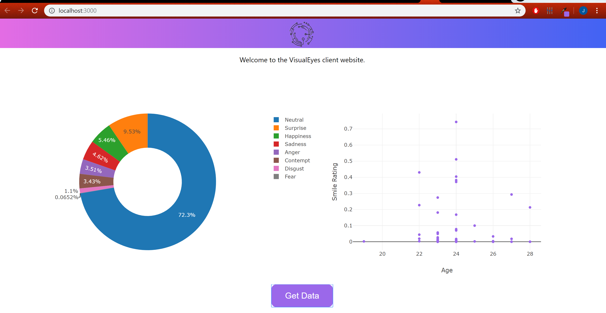

# Visual Eyes

**Powered by Azure Cognitive Services, ARKit2 and Firebase**

Eye-tracking and face analysis in AR, for recording user's focus and predicting user's geographics and emotion when reading marketing materials. Dynamically store analysis results at backend. Proof of concept at _BizHacks_. 

**First Place**, *Best Buy Price Winner* out of 400+ people.

*Click the image above to watch a demo*

## Architecture

<!---->
<!---->
<!--*Architecture diagram drawn by [Mai Matsuhisa](https://github.com/MAIMAI728)*-->

The iOS app tracks user's eye, calculates user's focal area and displays it on screen. It is also taking a facial snapshot of users for every 2 seconds, and uses Azure face analysis APIs from
cognitive services to predict user's age, gender and emotion during a set period. All the user data generated by the app are  uploaded to Firebase in real time, grouped by unique usernames and upload times.

In addition, a client website demo serves as a data visualization tool. It can display accumulated user emotions as a pie chart. It is built with React and JavaScript and reads data from the Firebase server and converts it into beautiful graphs built with Plotly.  
